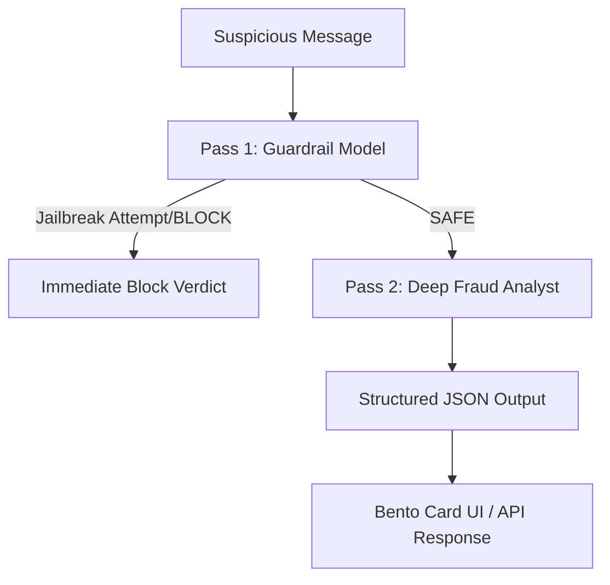
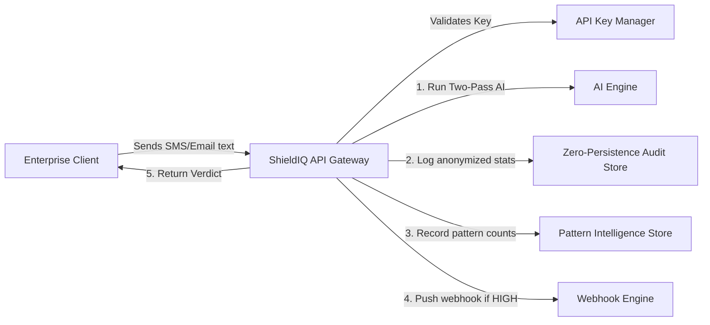

# ShieldIQ Startup & Enterprise Architecture Guide

This document provides a detailed breakdown of the ShieldIQ platform architecture. It explains how each feature works, why it was built, and how it fits into both the Consumer (B2C) and Business (B2B) models as you publish the application and scale it as a startup.

---

## 1. The Core AI Engine: Two-Pass Analysis
At the heart of ShieldIQ is a secure, two-stage analysis pipeline that protects both users and the AI engine itself.

### Pass 1: The Gatekeeper (Adversarial Guard)
* **Goal:** Detect and block prompt injections, override attempts (e.g., *"ignore previous instructions"*), or jailbreaks.
* **Why it matters:** Malicious users will try to trick the AI into clearing scam messages. Pass 1 is a fast, cheap pre-filter that makes the system resilient to hacking.
* **Implementation:** `PASS1_SYSTEM` in `prompts.py`. It returns a binary `SAFE` or `BLOCK` verdict.

### Pass 2: Deep Fraud Analysis (The Brain)
* **Goal:** Perform deep intent reasoning on the message.
* **Why it matters:** Instead of a simple "Blocked/Safe" message, it gives transparent, plain English reasons to educate the user.
* **Implementation:** Uses a deep reasoning model prompting for structured JSON. It evaluates:
  1. Artificial urgency.
  2. Financial requests.
  3. Sender mismatch/impersonation.
  4. Suspicious links or domains.
* **Output Format:**
  * **Risk Score (0-100)** & **Risk Level** (LOW, MEDIUM, HIGH).
  * **Summary:** One plain-English sentence a non-technical person (like a grandparent) understands.
  * **Reasons:** Exactly 3 concrete details noticed by the AI.
  * **Actionable Advice:** Immediate, practical next steps (e.g., *"Do not click the link; contact your bank directly"*).

---

## 2. Consumer (B2C) Features & Growth Loops

These features live on the frontend (`scan.html`, `index.html`) to maximize user conversion and drive revenue.

### Try Example Buttons (Frictionless Onboarding)
* **Features:** *Try Example: Bank Phishing*, *Try Example: CEO Impersonation*, *Try Example: Safe Message*.
* **Startup Strategy:** Minimizes "Time-to-Value". New users landing on your page can test the product instantly with one click, triggering the "Aha!" moment without needing to copy-paste a real message.

### Dynamic Scan Quota System
* **Rules:** Guests get 1 free scan/day. Registered users get 3 free scans/day.
* **Startup Strategy:** Limits your server costs while creating a natural upgrade hook. When users run out of scans, they are presented with pricing tiers: **Pro ($3.99/mo)** or **Shield Plus ($9.99/mo)**.

### Localization & Multi-Language Support
* **IP-based Geo Detection:** Automatically reads user location to display local currencies (e.g., NGN ₦ in Nigeria, INR ₹ in India, USD $ in the US).
* **Multi-Language UI:** Instant translation into English, Spanish, French, and Hindi, opening the product to global markets.

---

## 3. Business (B2B) & Enterprise Infrastructure

These background systems allow you to sell ShieldIQ as a high-margin, scalable service to corporations.

### B2B API Key Manager (`api_key_manager.py`)
* **Goal:** Generate, validate, and revoke secret API keys for paying business clients.
* **How it works:** Companies integrate your API directly into their customer support lines or mail servers. They pass their secret key in the request header to authorize their scans.

### Zero-Persistence Audit Trail (`audit_store.py`)
* **Goal:** Retain operational logs without storing private customer messages.
* **Compliance Value:** A massive selling point for enterprise compliance (GDPR/NDPR). You record latency, language, source, and risk scores, but **completely discard the message text** once analyzed. 

### Pattern Intelligence Store (`pattern_store.py`)
* **Goal:** Extract and tally anonymous threat signatures (e.g., "bank_impersonation").
* **Company Value:** Builds a proprietary threat database. Over time, you can sell reports on emerging regional scam trends to banks and telecom companies.

### Real-Time Webhook Engine (`webhook_router.py`)
* **Goal:** Alert corporate clients instantly when a high-risk security breach is detected.
* **How it works:** If a company's custom app detects a fraud threat, ShieldIQ fires a webhook payload to their endpoint, allowing them to instantly trigger internal mitigation scripts.

### Human-in-the-Loop Feedback (`was_overridden`)
* **Goal:** Record when human admins correct the AI.
* **How it works:** Provides data on false positives/negatives, allowing you to fine-tune your prompts and improve accuracy over time.

### Executive Admin Dashboard (`admin.html`)
* **Goal:** Visual interface for company security leads to monitor threat landscapes.
* **Metrics Shown:**
  * Total scans & average latency.
  * Verdicts by band (Safe vs Caution vs High Risk).
  * Attack vectors by source (Web, SMS, Email, WhatsApp).
  * Top fraud patterns and language breakdown.
  * Downloadable intelligence reports.

---

## 4. How the Two Models Contrast

| Metric | Consumer (B2C) | Enterprise (B2B) |
| :--- | :--- | :--- |
| **Interface** | Web App / Mobile Screen (`scan.html`) | Direct HTTPS API Endpoint (`/scan/json`) |
| **Pricing** | Freemium ($3.99/mo Pro or $9.99/mo Plus) | Custom Monthly Contract (SaaS Agreement) |
| **Scan Limits** | 1 to 3 daily free scans | Unlimited (subject to SLA agreements) |
| **Visibility** | Displays ShieldIQ branding & Bento cards | Fully white-labeled; processes silently in backend |
| **Data Control** | User sees history on dashboard | IT Admin sees aggregates on `/admin` portal |
